# Nada Boulares

## Data Scientist(AI, ML, DL, AWS..)
## Location and Availability

- Based in Tunisia
- Open to remote job opportunities
## Reach me [LinkedIn profile](https://www.linkedin.com/in/nada-boulares-83129214b/)  or [Gmail](mailto:nada.boulaares@gmail.com)
Please check [ my CV ](https://drive.google.com/file/d/1FlP3CBy2voSZ_SENq55foEYFDgHEkcMH/view?usp=sharing) for more details

### Summary
Experienced data scientist specializing in machine learning, deep learning,
and data visualization. Proficient in Python programming and databases
such as MySQL and MongoDB. Strong track record of developing and
deploying models, integrating recommendation systems, and collaborating
on impactful projects. Successfully delivered projects with measurable
outcomes and enhanced user experiences..
## Skills

- Machine Learning (Advanced)
- Deep Learning (Advanced)
- Data Visualization (Advanced)
- MongoDB (Advanced)
- Python (Advanced)
- AWS (Intermediate)
- MySQL (Intermediate)

### Experience
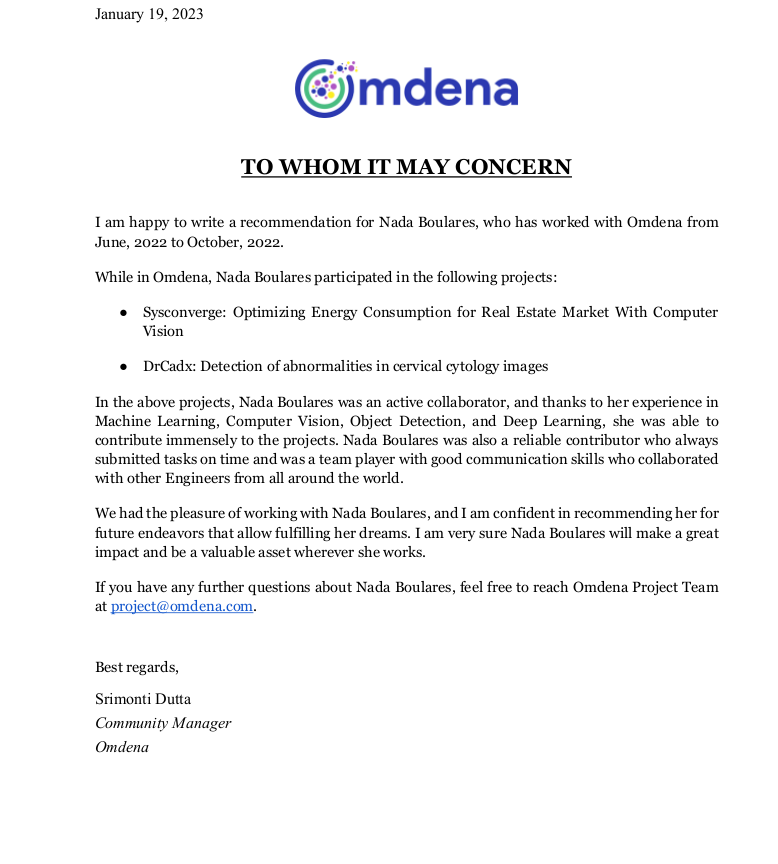
#### ML Engineer, Omdena, New York, United States.
##### April 2022 - Now
- Co-led the modeling task of the Minktek project Collaborated with a multidisciplinary
team to develop advanced models and algorithms, resulting in improved accuracy and
personalized treatment plans.
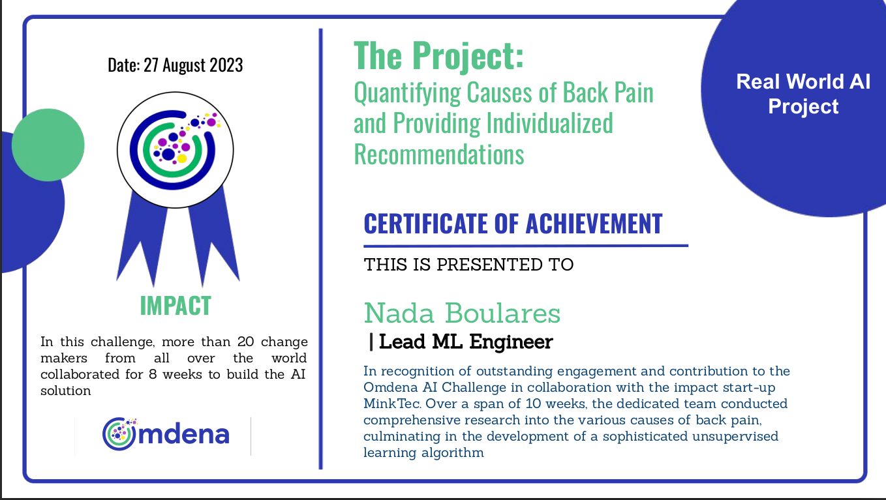
- Co-led the deployment task of the Belyntic project, Utilized Streamlit and FastAPI frame-
works to create user-friendly interfaces and ensure seamless integration. Additionally,
conducted comprehensive data collection by leveraging web scraping techniques with Beau-
tifulSoup and Selenium, enabling efficient data acquisition for the project.
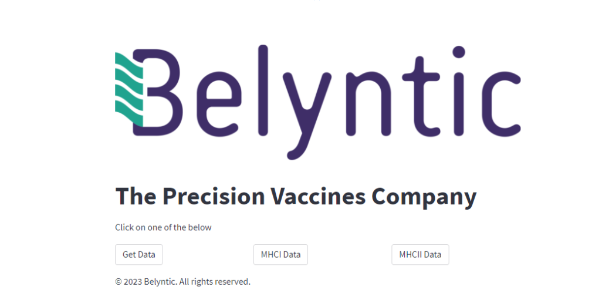
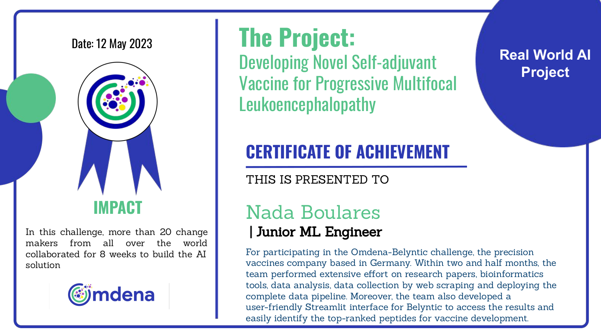

- Contributed to the BigCodeGen project, predicting short-term traffic flow congestion on
urban motorway networks. Labeled datasets using Labelbox and assisted in creating an
object detection model using YOLOv7..
 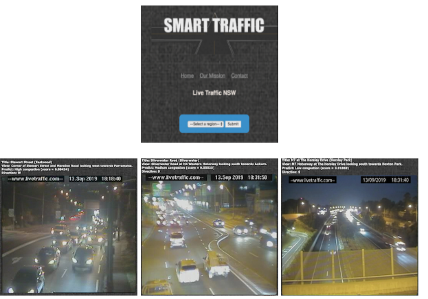
 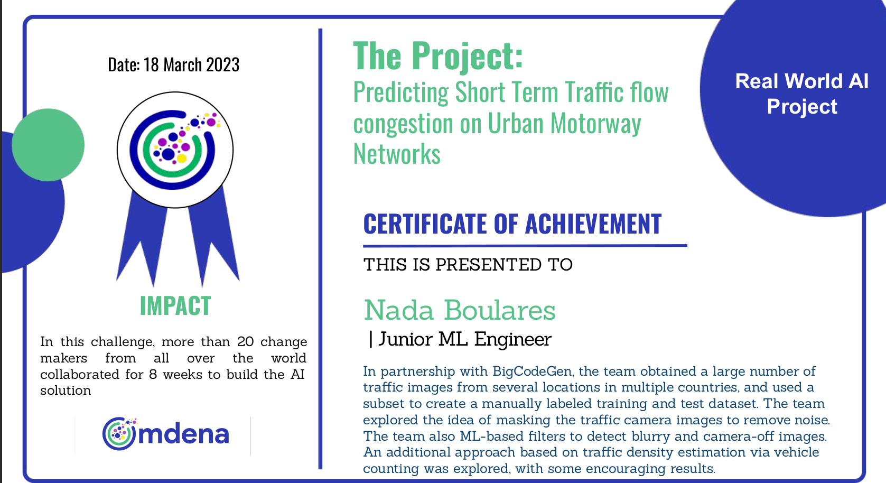
- Participated in the Dr CADx project, focused on reducing the risk of misdiagnosis of chest X-rays with deep learning. Involved in data collection from various resources and contributed to exploratory data analysis.
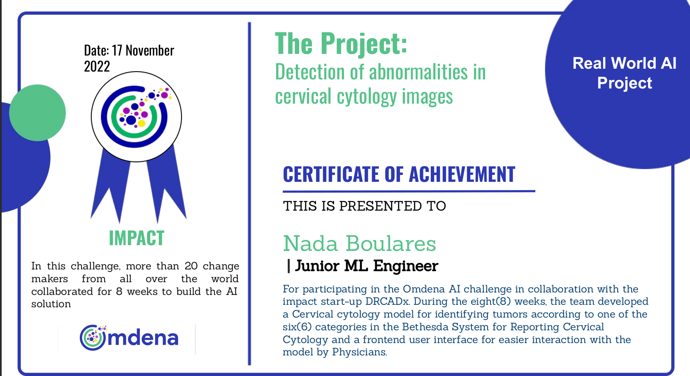
- Contributed to the Sysconverge project, optimizing energy consumption for the real estate
market using computer vision. Collected data from multiple sources, participated in
preprocessing tasks and modeling, and labeled datasets using MakeSense.AI and Label
Studio. Assisted in creating an object detection model for doors, windows, and plumbing
using YOLOv5.
 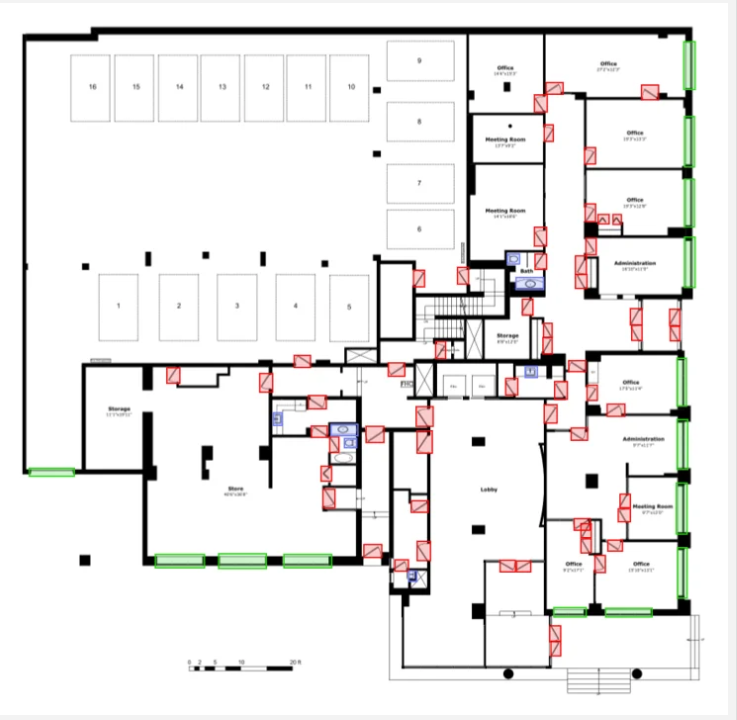
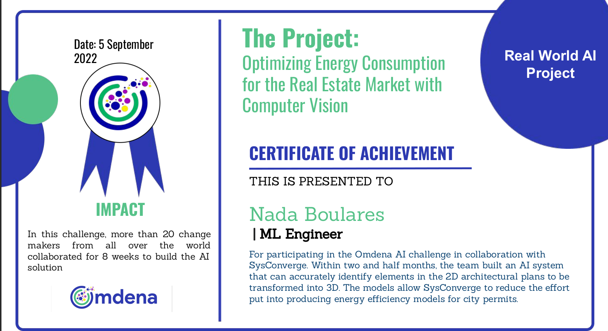
- Collaborated on the MangoSciences project, utilizing AI to support the affordability of
oncology immunotherapy treatments. Collected data from various sources, worked on
modeling tasks, and assisted in creating survival models. Developed a Cox-time model to
predict progression-free survival (PFS).
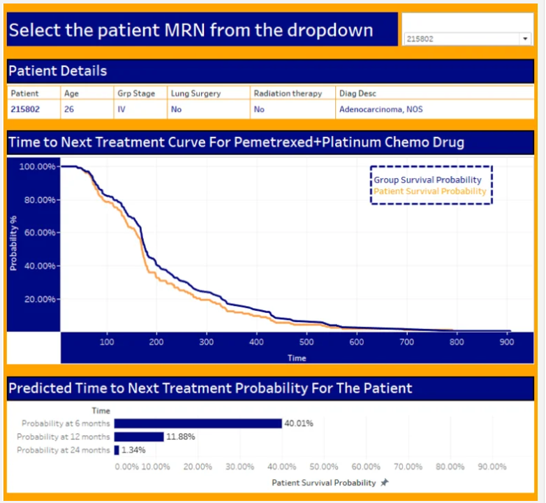
#### Data Science intern, Dance4Healing, California, United States.
##### August 2022 - Now
- Integrate a recommendation system on AWS using AWS Personalize, S3, and EC2, enhancing
the user experience and driving personalized recommendations.
- Applied matrix factorization techniques to solve the cold start problem, improving the
system’s ability to make accurate recommendations for new users or items.
- Assisted in building the project architecture, utilizing AWS RDS and AWS DynamoDB for
efficient data storage and retrieval.
- Developed a recommendation system using machine learning techniques such as K-Means
and Scipy. Explored the Dance4healing database in MongoDB, downloaded relevant
datasets, and performed data generation. Utilized data visualization libraries like Seaborn
and Matplotlib. Created a machine learning model to recommend dance session videos
based on factors such as emotion, duration, and energy level. Deployed the model using
Flask and contributed to version control on the organization’s GitHub repository.
- Contributed to the translation of videos from English to Chinese by leveraging AWS services
such as S3, AWS Transcribe, AWS Translate, and AWS Elastic Transcoder, enabling
multilingual accessibility.
- Collaborated on creating a user dashboard, utilizing tools such as Figma and Python
libraries like Matplotlib and Seaborn. Designed a new desktop interface to enhance user
interaction and visual representation.

#### Data Science and Business Analytics intern, Sparks Foundation, Singapore.
##### Juin 2022 - Juillet 2022
- Conducted data analysis and visualization to derive meaningful insights.
- Employed decision tree algorithms for prediction tasks.
- Developed a face mask detection system using OpenCV, Keras, and TensorFlow.
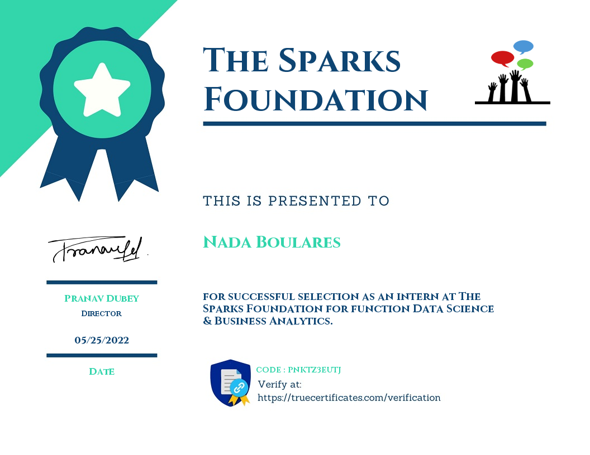
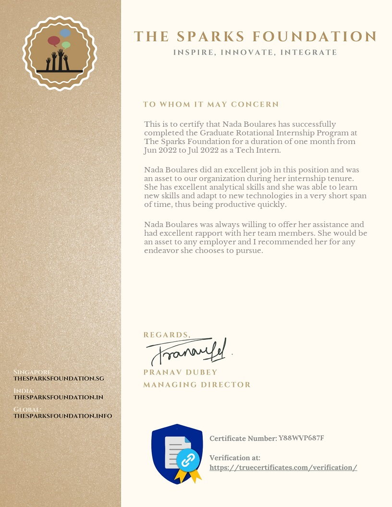

#### Data Science intern, REGIM Lab, Sfax, Tunisia.
##### February 2021 - September 2021
- Deployed the developed model in a mobile application using Flutter and Django, ensuring
seamless integration and accessibility.
- Successfully developed a deep learning model for facial recognition using Insightface and
ArcFace algorithms, utilizing Nvidia, CUDA, TensorFlow, and Keras frameworks.
- Conducted a comprehensive comparison of pre-trained models in the Mxnet framework to
evaluate their performance and suitability for specific tasks.
- Prepared face detection models, including MTCNN, RetinaFace, and Antelope, for accurate
facial analysis and identification.
- Collected and meticulously prepared data for use with the Mxnet library.
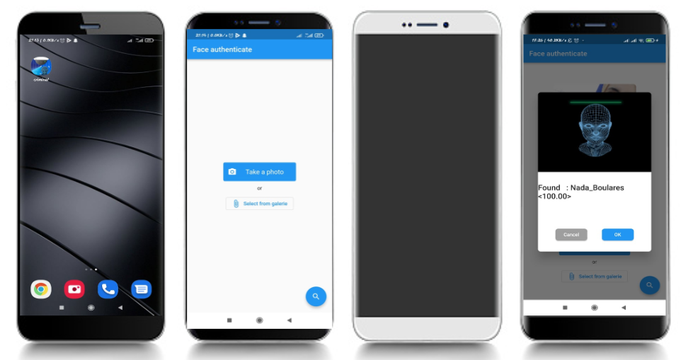
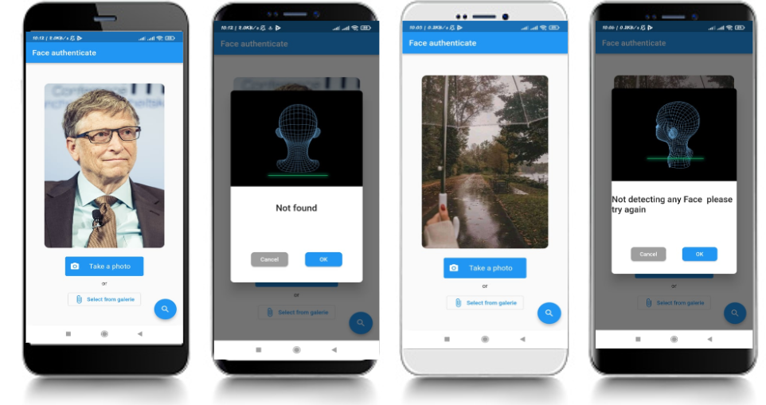

# Additional Technologies:
- JavaScript (intermediate level)
- Flutter (beginner level)
- PHP (advanced level)
- Angular (intermediate level)
