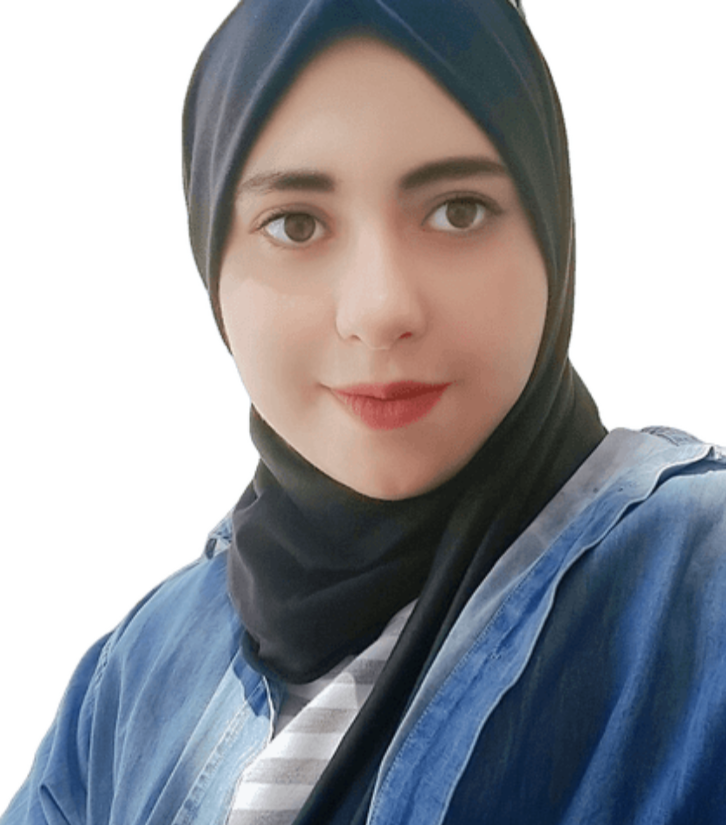

# Nada Boulares

## Data Scientist
## Reach me [My LinkedIn profile](https://www.linkedin.com/in/nada-boulares-83129214b/)  or [Gmail](nada.boulaares@gmail.com)

### Summary
As an experienced data scientist, I specialize in machine learning, deep learning, and data visualization. My diverse project experience as a former Junior ML Engineer at Omdena, where I was promoted to lead the ML Engineering deployment task, has given me extensive knowledge in these areas. Additionally, I have worked as a data scientist intern with Dance4Healing, gaining expertise in AWS and completing various projects. I am highly proficient in Python programming language and have extensive knowledge of databases such as MySQL and MongoDB.
## Skills

- Machine Learning (Advanced)
- Deep Learning (Advanced)
- Data Visualization (Advanced)
- MongoDB (Advanced)
- Python (Advanced)
- AWS (Intermediate)
- MySQL (Intermediate)

### Experience
#### Lead ML Engineer, Omdena, New York, United States.
##### February 2023 - Now
- Belyntic project: Development of Novel Self-adjuvant Vaccine for Progressive multifocal leukoencephalopathy.Coleading IN the deployment task (Streamlit, FastAPI).

#### Data Science intern, Dance4Healing, California, United States.
##### August 2022 - Now
- Integrating the recommendation system on AWS (AWS Personalize, S3, EC2).
- Working on translating videos from the English language to Chinese (S3; AWS Transcribe; AWS Translate; AWS Elastic Transcoder).
- Helping in building the project architecture; working with AWS RDS and AWS DynamoDB.
- Building a Recommendation System using Machine Learning: K-Means; Scipy (Exploring the database of Dance4healing in MongoDB and downloading datasets, Generating data, Visualising Data: Seaborn; matplotlib, Creating a machine learning model to recommend the group of video of dance session using emotion, duration, and energy level, Deploying the model using Flask, and Push the code to the organization Github.
- Helping in creating a user dashboard using Figma and matplotlib, Seaborn Python (Designing a new desktop).

#### ML Engineer, Omdena, New York, United States.
##### April 2022 - February 2023
- BigCodeGen project: Predicting Short-Term Traffic Flow Congestion on Urban Motorway Networks (Labeling datasets: image using Labelbox, Helping in create an object detection model using YOLOV7).
- Dr CADx project: Reducing the Risk of Misdiagnosis of Chest X-rays with Deep Learning project (Collecting Data from many resources, joining EDA task).
- Sysconverge project: Optimizing Energy Consumption for Real Estate Market With Computer Vision project (Collecting Data from many resources, Participating in preprocessing task and modeling task Labeling dataset using MakeSense.AI and Label Studio, helping in Create a object detection model: door,windows ,plumbing (YOLOv5)).
- MangoSciences project: Using AI to support affordability of oncology immunotherapy treatments (Collect Data from many resources, Working in modeling task, Helping in create survival models, Create a cox-time model to predict PFS).

#### Data Science and Business Analytics intern, Sparks Foundation, Singapore.
##### Juin 2022 - Juillet 2022
- Data Analysis and Visualization.
- Prediction using Decision Tree Algorithm.
- Face mask detection using Opencv, Keras, Tensorflow.

#### Data Science intern, REGIM Lab, Sfax, Tunisia.
##### February 2021 - September 2021
- Realization of a deep learning model for facial recognition (Insightface, ArcFace).
- Collection and preparation of data (to use the Mxnet library).
- Preparation of face detection models (MTCNN, RetinaFace, Antelope).
- Comparison of Mxnet pre trained models.
- Deployment of the model in a mobile application (Flutter;Django).

#### Developer Intern
